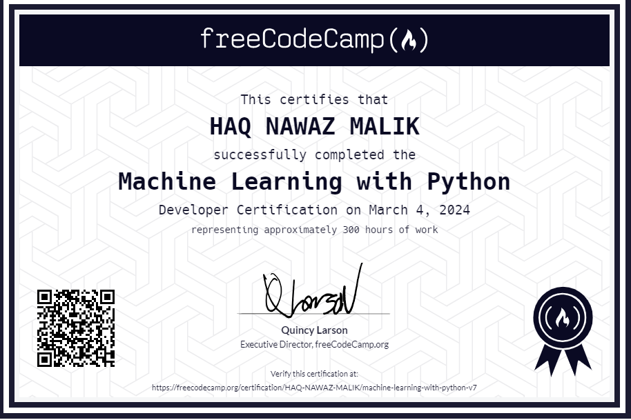

# Neural-Network-SMS-Text-Classifier
a machine learning model that will classify SMS messages as either "ham" or "spam". A "ham" message is a normal message sent by a friend. A "spam" message is an advertisement or a message sent by a company.

[!Machine Learning with Python -Freecodecamp](Machine Learning with Python -Freecodecamp.PNG)
